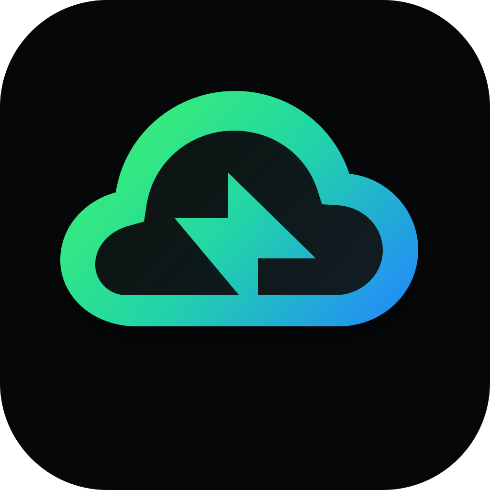

<p align="center">
  
</p>

<h1 align="center">CTX</h1>

<p align="center">
  <strong>Native macOS cloud context switching and Kubernetes inspection.</strong>
</p>

<p align="center">
  
  
  
</p>

CTX discovers AWS, GCP, Azure, and Kubernetes contexts from local configuration
and uses the command-line tools already installed on your Mac. It has no hosted
backend, account, or telemetry.

## Features

- Fast context access from a native menu bar app and main window.
- AWS, GCP, Azure, and Kubernetes profile discovery, verification, and switching.
- Profile folders plus provider, folder, appearance, and update settings.
- CLI discovery across common macOS install locations, with guided installation
  when a required tool is missing.
- Existing-session reuse and in-app sign-in when authentication is required.
- A read-only Kubernetes workspace with Overview, Issues, resource tables,
  bounded logs, GitOps, Helm, exports, diff, Service port forwarding, and an
  interactive topology Map.
- Automatic update checks with an in-app install action.

## Install

```bash
brew install --cask opsbit-io/tap/ctx
```

Later releases arrive with `brew upgrade --cask ctx`. If `CTX.app` is already in
`/Applications` from an earlier manual install, add `--force` the first time so
Homebrew adopts it.

Without Homebrew, the same release installs with:

```bash
curl -fsSL https://raw.githubusercontent.com/opsbit-io/ctx/main/script/install.sh | bash
```

Or download `CTX.app.zip` from
[Releases](https://github.com/opsbit-io/ctx/releases), extract it, move
`CTX.app` to `/Applications`, and clear the quarantine flag macOS puts on it:

```bash
xattr -rd com.apple.quarantine /Applications/CTX.app
```

To build and run from source:

```bash
./script/build_and_run.sh run
```

## Requirements

- macOS 14 or newer.
- Swift 5.10 or newer when building from source.
- The CLI for each provider you use: `aws`, `gcloud`, `az`, or `kubectl`.
- `helm` for full Helm release details; CTX can fall back to safe metadata.
- `sdm` or `tsh` only for clusters that use those access brokers.

CTX never installs tools without your action.

## Safety

Kubernetes inspection always uses an explicit context and preserves the
discovered kubeconfig path. CTX does not apply, patch, delete, scale, drain,
cordon, exec, open a shell, or edit YAML.

Secret and ConfigMap values are not displayed, logged, exported, or cached.
Port forwarding is limited to explicit Service tunnels bound to `127.0.0.1`,
with visible sessions and Stop controls.

## Development

```bash
swift build
swift run CTXCoreTests
swift run CTXCheck
./script/build_and_run.sh verify
```


## License

CTX is available under the [MIT License](LICENSE).
